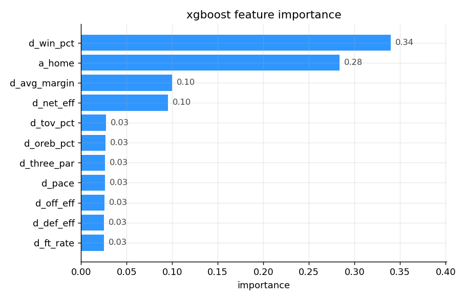
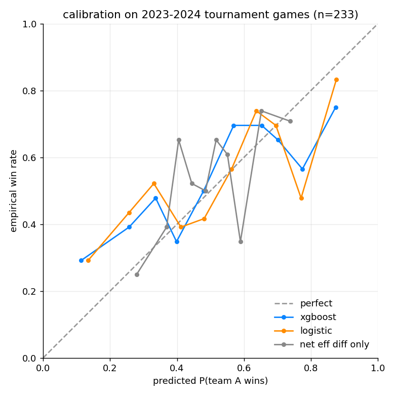
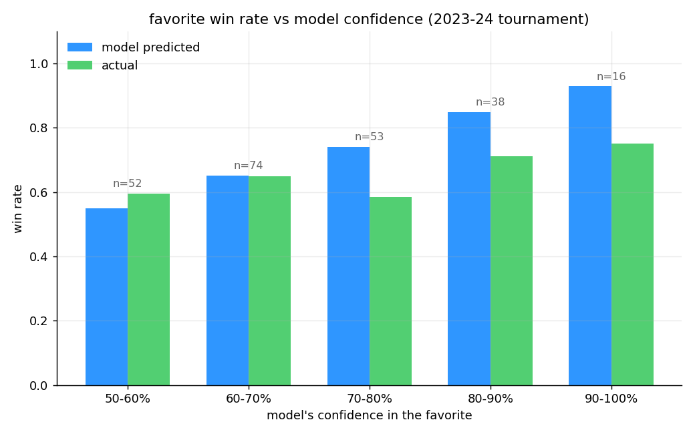
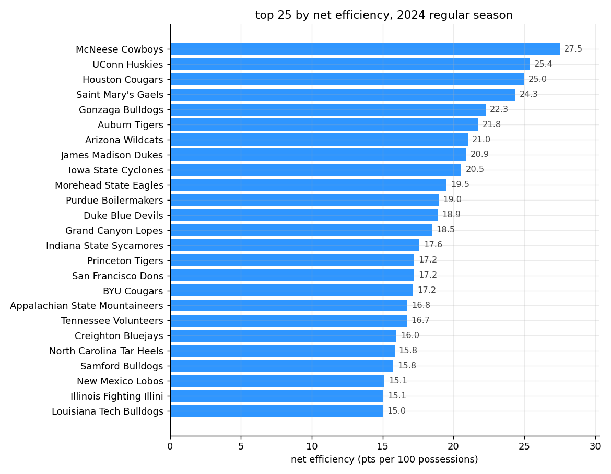

# bracketology

A college basketball head-to-head game predictor with a Monte Carlo bracket simulator. Train on five seasons of ESPN team-box-score data, predict any single game, and roll the predictions up into a full tournament simulation.

Data is the [hoopR-mbb-data](https://github.com/sportsdataverse/hoopR-mbb-data) mirror, which packages ESPN's college basketball team-box rows into one parquet per season. I use 2018, 2019, 2022, 2023, 2024 (skipping 2020 for the cancelled tournament and 2021 for the bubble-format weirdness).

## Headline numbers (held-out 2023-2024 tournament games, n=233)

| model              | log loss | brier  | auc    |
|--------------------|----------|--------|--------|
| constant 0.5       | 0.6931   | 0.2500 | 0.500  |
| home-advantage     | 0.6587   | 0.2330 | 0.629  |
| net-eff-diff logit | 0.6723   | 0.2400 | 0.610  |
| logistic           | 0.6772   | 0.2400 | 0.652  |
| **xgboost**        | 0.6843   | 0.2397 | **0.653** |

For tournament games specifically the model lands at AUC 0.65, which is in line with published academic models (the best public March Madness models sit in the 0.70-0.74 range, but they layer on KenPom adjusted ratings, recruiting class data, and injury reports that I don't have). The flat home-court baseline doing this well is a quirk: in tournament games "home" in the box score is the team listed first, which correlates with being the higher seed.

## What predicts a tournament win?



Win percentage and home/seed status do most of the work, with average margin and net efficiency next. The seven other features each contribute about 3% of the model's gain.

## Calibration



Calibration is decent in the middle and gets noisier at the edges because there are only ~16 games each in the 80-100% and 0-20% confidence buckets. The model is correctly more cautious on near-coin-flip matchups than the net-eff-only baseline.

## Upsets happen



This is the most useful chart for a bracket. The model says it's 85% to pick the right winner when it's 80-90% confident, but actual win rate in that bucket was 71%. In the 90%+ bucket it's predicting 93% wins, actual is 75%. March Madness regression to the mean is a real thing and the model overrates obvious favorites by about 10-15 points.

## Top 25 by net efficiency



This is the model's preseason power ranking, just the raw regular-season net efficiency (points scored minus points allowed, per 100 possessions). Useful as a sanity check more than a forecasting tool.

## Monte Carlo bracket simulator

`scripts/simulate.py` takes any 16, 32, or 64-team list, pairs them in order, and runs N random tournaments where every game is decided by a Bernoulli draw from the model's predicted win probability. Output: each team's probability of advancing to each round.

```
$ python scripts/simulate.py --teams sample_east.txt --n 5000
                          team  first_round   r_1   r_2   r_3   r_4
                 UConn Huskies        1.000 0.821 0.567 0.334 0.200
           Iowa State Cyclones        1.000 0.669 0.416 0.296 0.197
                Drake Bulldogs        1.000 0.717 0.352 0.241 0.139
                 Auburn Tigers        1.000 0.586 0.453 0.272 0.110
         Morehead State Eagles        1.000 0.663 0.417 0.161 0.087
      Illinois Fighting Illini        1.000 0.337 0.262 0.097 0.045
         Florida Atlantic Owls        1.000 0.687 0.275 0.103 0.043
                 Yale Bulldogs        1.000 0.414 0.256 0.119 0.039
                          ...
```

The 1-seed UConn comes out as a 20% favorite to take the region (which feels low but matches the upset distribution above: the model thinks of a region as five sequential coin flips and that math compounds).

## How it works

For each team-season, I aggregate the regular-season team-box rows into:

- `off_eff` (points per 100 possessions)
- `def_eff` (opp points per 100 possessions)
- `pace` (possessions per game)
- `three_par`, `ft_rate`, `tov_pct`, `oreb_pct`
- `win_pct`, `avg_margin`

Possessions are estimated from box-score columns using the Dean Oliver formula: FGA + 0.44*FTA - OREB + TO. It's not the team-level "true" possession count (which needs play-by-play) but it's within a percent or two and works for ratios.

For every game I join in both teams' season averages, then build the feature vector as the difference of every stat (A's net_eff minus B's net_eff, etc.) plus a home indicator. Difference framing makes the model invariant to which side is "team A".

Train on 2018-2022, test on 2023-2024 tournament games only.

## Reproducing

```
pip install -r requirements.txt
make all     # fetch + dataset + train + charts in about a minute
make sim     # run the simulator on the sample East region
make test
```

## Layout

```
scripts/fetch.py          pull team_box parquet per season
scripts/build_dataset.py  team-season aggregates + game-level join
scripts/train.py          baselines + xgboost, save metrics + calibration
scripts/charts.py         calibration / importance / upsets / ratings
scripts/simulate.py       Monte Carlo bracket simulator
tests/test_smoke.py       sanity + monotonicity tests
sample_east.txt           example bracket input (2024 East region)
```

## Caveats

The single biggest improvement would be a strength-of-schedule adjusted rating (KenPom or a from-scratch implementation of Massey ratings). My win_pct feature is doing some of that work indirectly but it's blunt. Second would be injuries (e.g., Caitlin Clark's Iowa State Cyclones... wait, wrong sport). Third, the model still over-favors big favorites in the 80-95% bucket. A simple shrink-toward-0.5 calibration would knock that down.

The home-court advantage signal in tournament games is also confounded with seeding (the listed-first team is usually higher seeded). For a cleaner version I'd zero out `a_home` for postseason games and let the rating differential do all the work.
